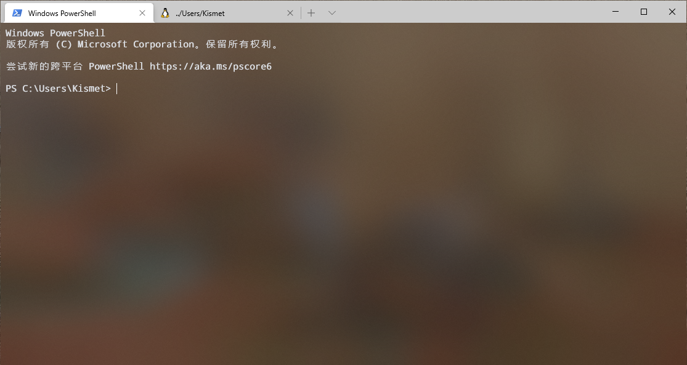

# Windows Terminal Configuration

Install Windows Terminal from [Windows Store](https://www.microsoft.com/zh-cn/p/windows-terminal/9n0dx20hk701?rtc=1&activetab=pivot:overviewtab).

## Setting

Move `settings.json` to

```
C:\Users\xxxxxx\AppData\Local\Packages\Microsoft.WindowsTerminal_xxxxxxxxxx\LocalState\
```

Refer to [Microsoft Docs](https://docs.microsoft.com/zh-cn/windows/terminal/customize-settings/profile-settings).

## Font

Install `DroidSansMonoForPowerlinePlusNerdFileTypesMono.otf`

Name : `"Droid Sans Mono for Powerline Plus Nerd File Types Mono"`

Refer to [powerline-extra-symbols](https://github.com/ryanoasis/powerline-extra-symbols).

## Preview

